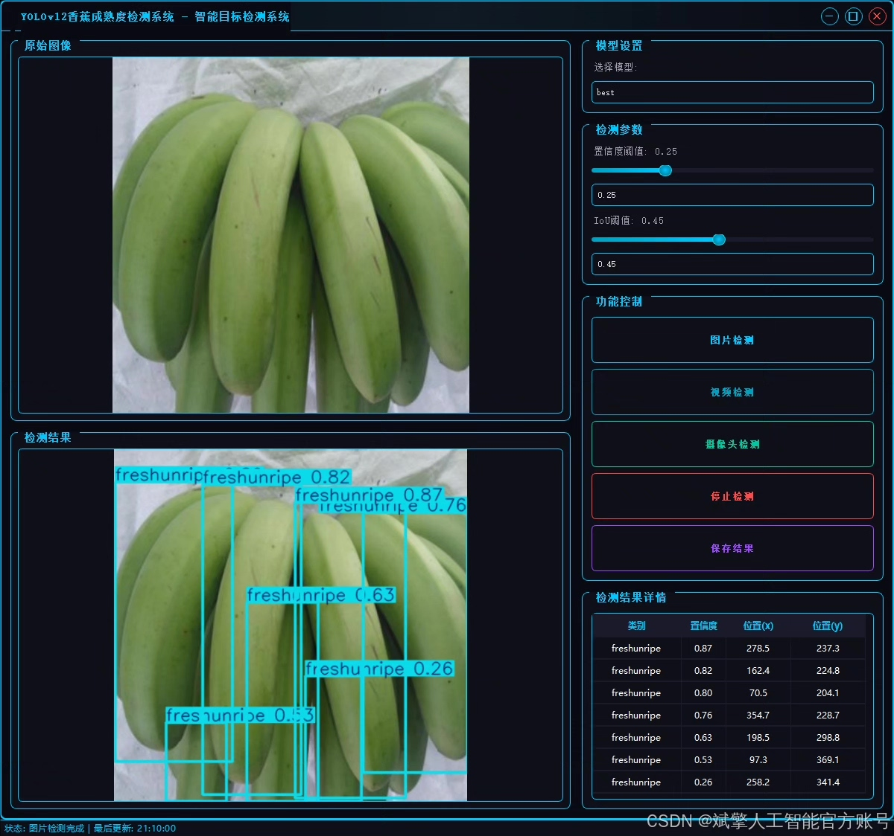
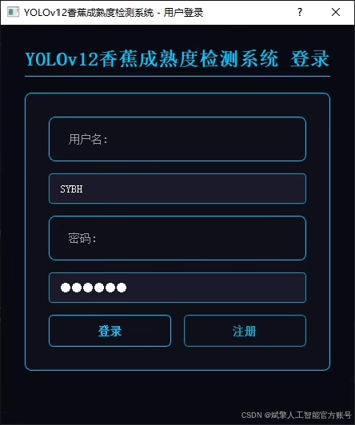
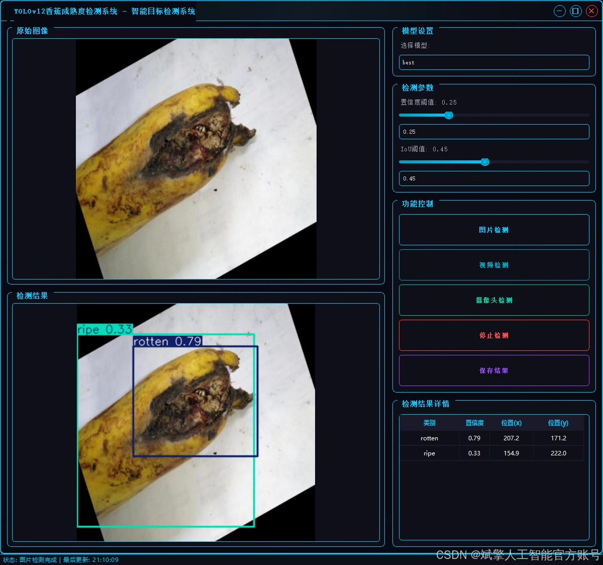
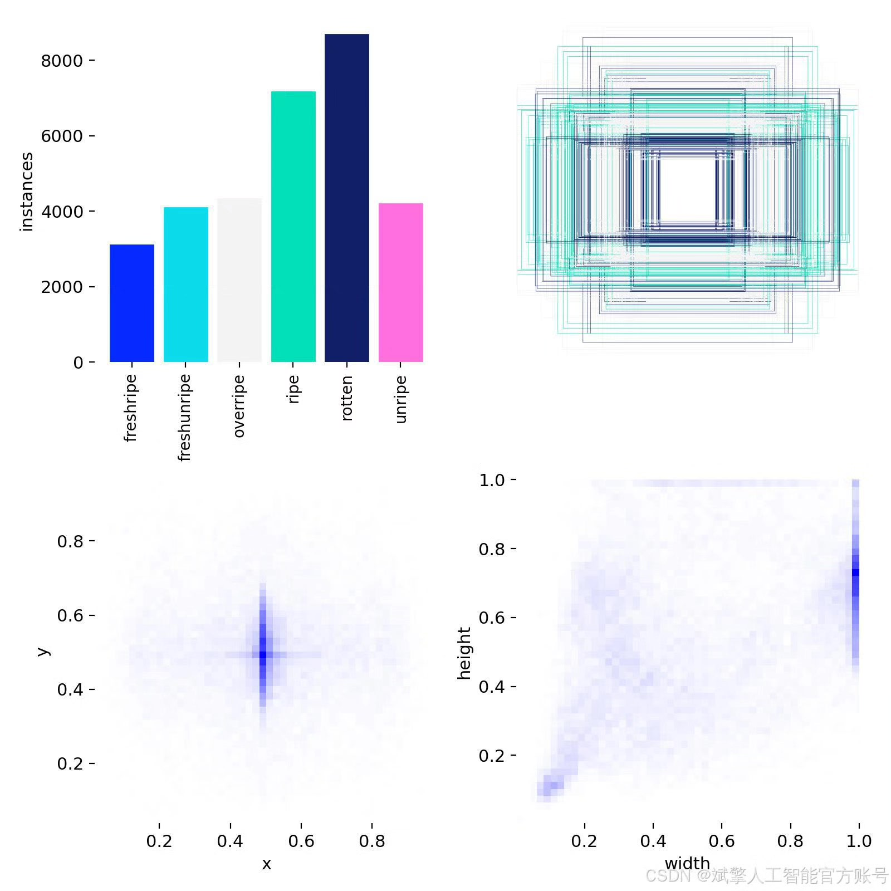
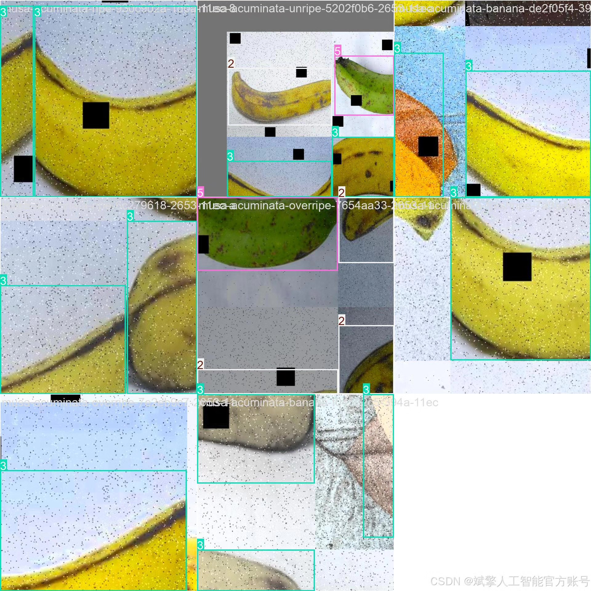
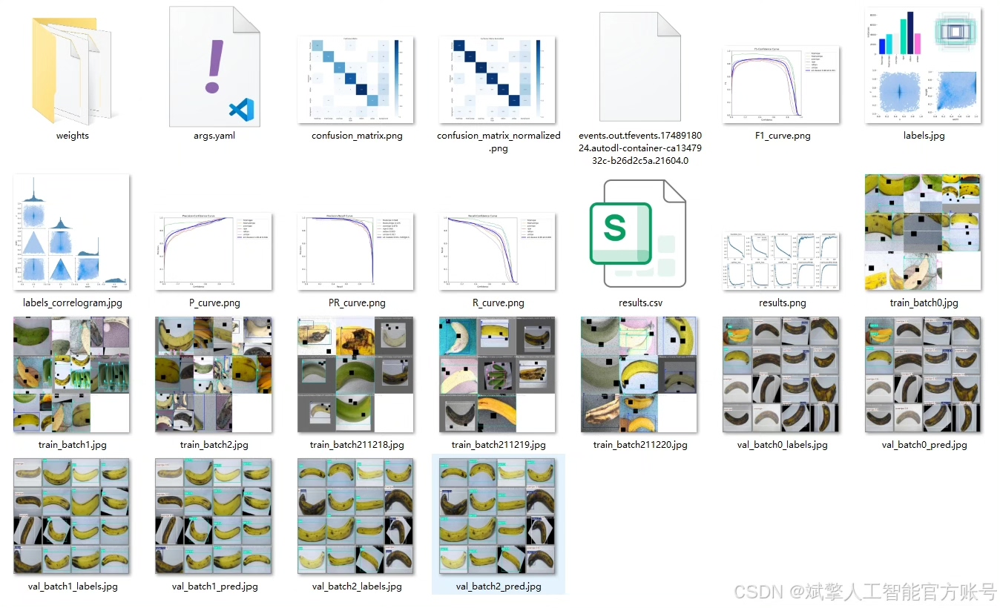
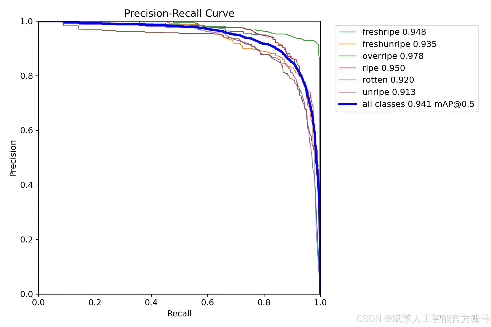
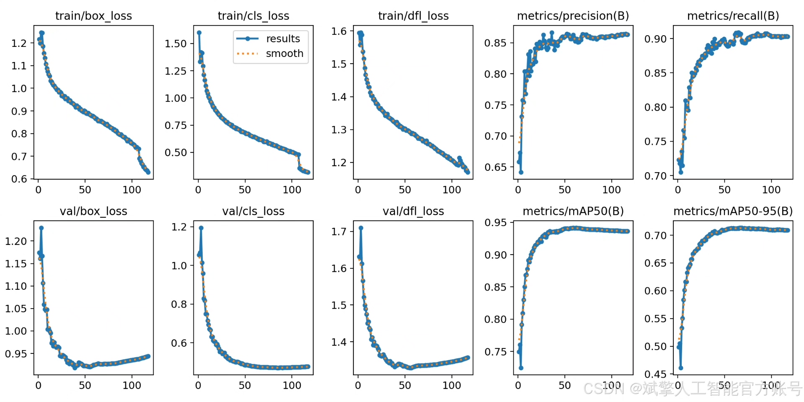
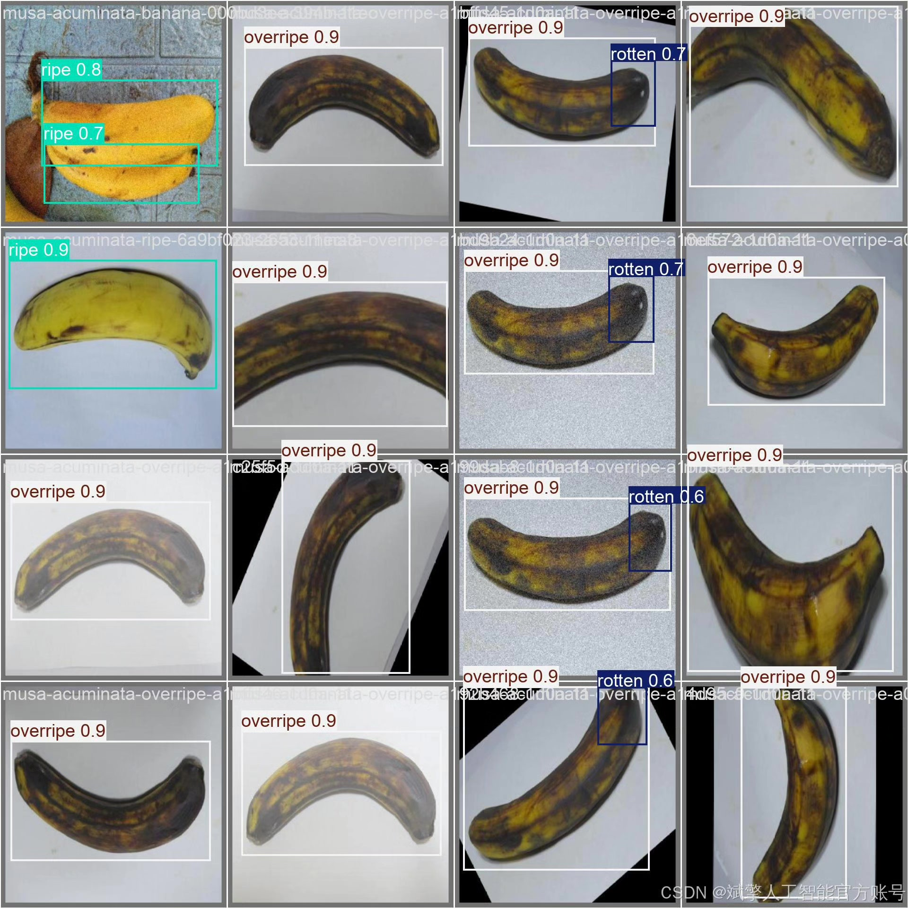

# YOLOv12 Banana Maturity Recognition System

## Body

YOLOv12 Banana Maturity Identification System Based on Deep Learning YOLOv12 - A banana maturity identification detection system (YOLOv12+YOLO dataset + UI interface + login registration interface + Python project source code + model)

This project is based on the YOLOv12 deep learning algorithm and has developed a high-efficiency, precise intelligent banana maturity identification detection system. The system can automatically detect and classify six maturity states of bananas, including fresh ripe (freshripe), fresh unripe (freshunripe), overripe (overripe), ripe (ripe), rotten (rotten), and unripe (unripe). It can be widely applied in fields such as agricultural product quality inspection, intelligent sorting, storage management, and retail industry product quality control.

The system uses a high-quality dataset consisting of 15,792 training images, 1,525 validation images, and 757 test images to train the model, ensuring the accuracy and generalization ability of the detection. At the same time, the project integrates a user-friendly UI interface, supporting login/registration functions, facilitating multi-user management and operation. The YOLOv12 model achieves the optimal balance between detection speed and accuracy, capable of real-time processing of banana image data and outputting maturity classification results, providing a reliable solution for agricultural intelligent management.

✅ User Login Registration: Supports password verification and security validation.
✅ Three detection modes: Based on the YOLOv12 model, supports image, video, and real-time camera detection, accurately identifying targets.
✅ Dual-screen comparison: Displays the original image and detection results on the same screen.
✅ Data visualization: Real-time table displaying the category, confidence, and coordinates of detected targets.
✅ Intelligent parameter adjustment: Offers a confidence slide bar, dynamically optimizing detection accuracy to meet different scene requirements.
✅ Sci-fi style interactive interface: Dark theme combined with dynamic light effects, reducing visual fatigue and improving operational experience.

## Images

## Payment

Here is a pay link on Stripe ( https://buy.stripe.com/3cs8yP7sY87d0vu9AB ). Please contact me lonlonago@foxmail.com after funding $89, and I will send you a complete data files , thank you!

